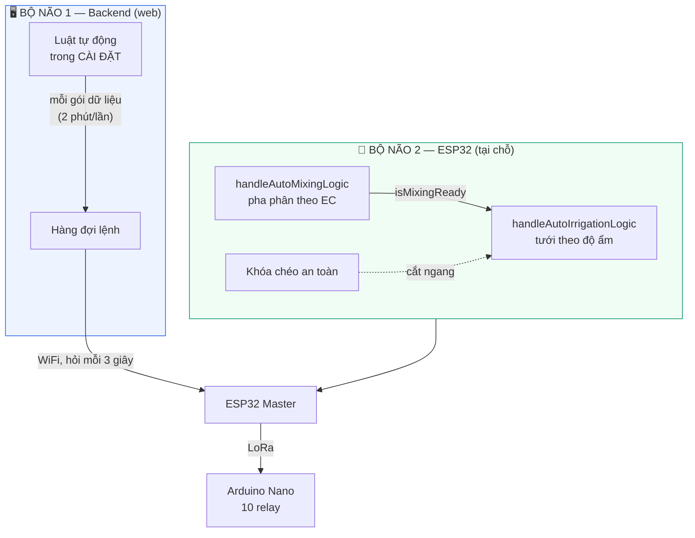
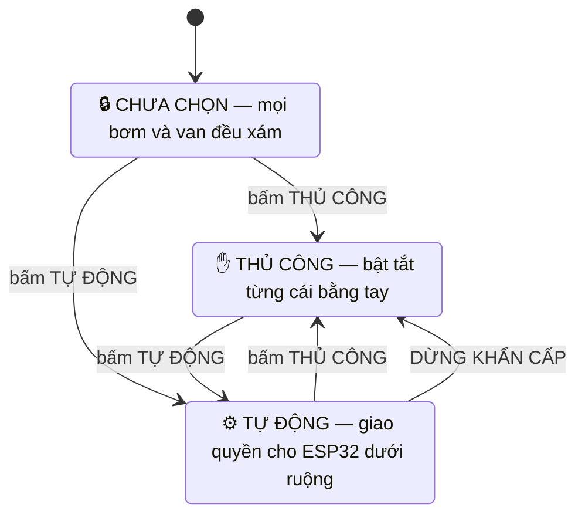
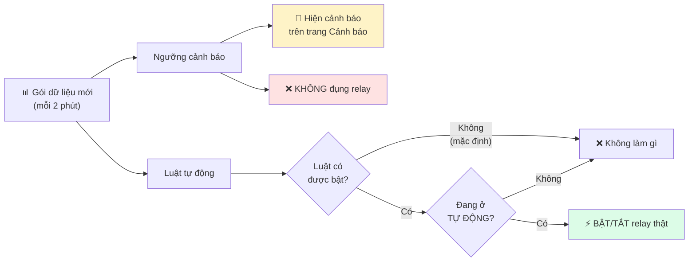
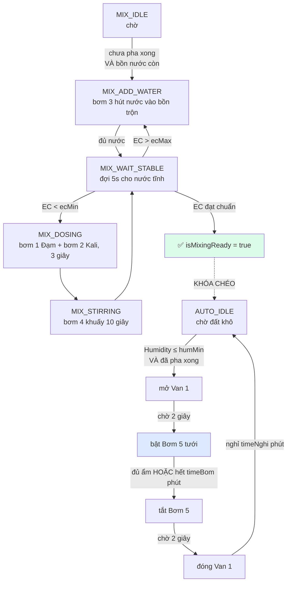
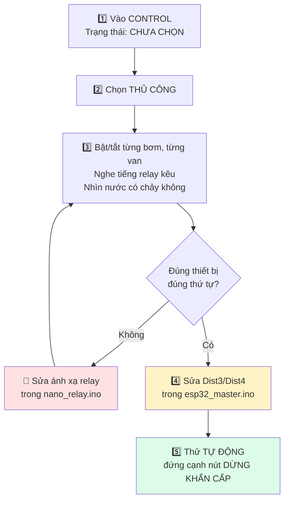

# 🎛️ Hướng dẫn màn hình CONTROL, Ngưỡng và Luật tự động

Tài liệu này trả lời ba câu hỏi hay bị lẫn vào nhau:

1. Màn hình **CONTROL** hoạt động thế nào?
2. **Ngưỡng** trong CÀI ĐẶT có tự bật van không?
3. **Khóa chéo an toàn** trong ESP32 là gì?

---

## 1. Bức tranh tổng: hệ thống có HAI bộ não

Đây là điều phải hiểu trước mọi thứ khác. Cùng một dàn relay nhưng có **hai** chỗ
có thể ra lệnh, và chúng **không biết đến nhau**.



| | Bộ não 1 — Backend | Bộ não 2 — ESP32 |
|---|---|---|
| Chạy ở đâu | Máy tính | Ngay trên board |
| Mất mạng WiFi | ❌ chết | ✅ vẫn chạy |
| Nhịp quyết định | 2 phút/lần | liên tục |
| Có khóa chéo an toàn | ❌ không | ✅ có |
| Cấu hình ở đâu | CÀI ĐẶT → Luật tự động | Màn Nextion |
| **Mặc định** | **TẮT HẾT** | **Đang dùng** |

> ⚠️ **Chỉ được bật một. Nhưng hai kiểu "bật cả hai" nguy hiểm rất khác nhau** —
> xem mục 4.1 bên dưới. Tóm tắt: **để nguyên Luật tự động ở web là TẮT**, vì
> ESP32 có khóa chéo an toàn mà backend hoàn toàn không có.

---

## 2. Màn hình CONTROL

### Ba trạng thái



| Trạng thái | Công tắc bơm/van | Luật tự động |
|---|---|---|
| 🔒 **CHƯA CHỌN** | xám, không bấm được | không chạy |
| ✋ **THỦ CÔNG** | bấm được từng cái | không chạy |
| ⚙️ **TỰ ĐỘNG** | khóa (phần cứng từ chối) | chạy |

**Mới cài xong hoặc mới `git pull` thì luôn ở CHƯA CHỌN.** Đây là chủ ý: cả hai
chế độ đều điều khiển bơm thật, nên phải là lựa chọn có ý thức của người vận
hành, không bao giờ là mặc định.

### Bấm TỰ ĐỘNG thì chuyện gì xảy ra

**Không bật gì cả.** Web chỉ gửi đúng một lệnh `mode=AUTO` rồi giao quyền cho
máy trạng thái chạy trên ESP32 — nơi có khóa chéo bồn cạn và trời mưa mà backend
không có.

Bản trước web bật sẵn cả 9 thiết bị rồi mới giao quyền. Bỏ đi vì hai lẽ: máy
trạng thái ghi đè lại sau vài giây, và bật bơm Đạm/Kali khi **chưa pha, chưa
khuấy** là sai quy trình dinh dưỡng.

Đổi lại, màn CONTROL vẽ **dải tiến trình** cho biết máy đang ở bước nào:

```
Pha phân:  [đổ nước] → [đo EC] → [châm Đạm+Kali] → [khuấy] → ✅ đạt chuẩn
                                                      │
                              chưa đạt chuẩn thì KHÓA tưới
                                                      ↓
Tưới:      [chờ đất khô] → [mở van] → [đang tưới] → [đóng van] → [nghỉ thấm]
```

### Nút "Kiểm tra toàn dàn" — chỉ hiện ở THỦ CÔNG

Việc quét bật lần lượt toàn bộ thiết bị nay là **một nút riêng**, dùng khi
nghiệm thu đấu dây tủ điện:

```
  giây   0    2    4    6    8   10   12   14   16
  VAN    ▓───▓───▓───▓
         Van1 Van2 Van3 Van4          ← mở trước
  BƠM                        ▓───▓───▓───▓───▓
                             Bơm1 Bơm2 Bơm3 Bơm4 Bơm5
```

| Bảo đảm | Vì sao |
|---|---|
| **Cách nhau 2 giây** | 5 mô-tơ bơm đóng cùng lúc là cú dòng khởi động lớn lên tủ |
| **Van mở trước bơm** | Bơm chạy vào ống đóng là **chạy chết máy** (dead-head) |
| **Chỉ chạy ở THỦ CÔNG** | Ở TỰ ĐỘNG, Nano từ chối mọi lệnh tay — quét sẽ bị NACK sạch |

Cơ chế: mỗi lệnh có cột `run_after` trong hàng đợi. Lệnh vẫn nằm đó nhưng backend
**không đưa cho ESP32** cho tới đúng giờ — nên giãn cách được giữ nguyên bất kể
ESP32 hỏi nhanh hay chậm.

### Vì sao TỰ ĐỘNG lại khóa công tắc

Không phải web tự bịa ra. **Phần cứng thật sự từ chối:**

```
Web bấm bật Bơm 1
   ↓
ESP32: systemMode == 1 → "đang ở TỰ ĐỘNG, từ chối lệnh tay từ web"
   ↓ (nếu lọt qua được)
Nano:  isAutoMode == true → "[KHÓA AN TOÀN] từ chối bật tay từ Lora!"
```

Nếu web vẫn cho bấm thì nút sẽ **báo lỗi**, không phải bật được. Khóa nút là nói
thật về cái đang xảy ra, không phải hạn chế do phần mềm tự đặt ra.

### Nút DỪNG KHẨN CẤP

Bấm **hai lần** để chạy (lần đầu chỉ lên nòng, tự hủy sau 5 giây). Khi chạy:

1. Xếp hàng **TẮT** cho cả 9 thiết bị — **không giãn cách**, cắt là cắt ngay
2. Ép hệ thống về **THỦ CÔNG**
3. Chặn mọi lệnh BẬT (trả `409`) và chặn cả việc bật TỰ ĐỘNG
4. Ghi cảnh báo mức `danger`

Gỡ dừng khẩn cấp **không** khởi động lại gì cả. Hệ thống nằm ở THỦ CÔNG cho tới
khi bạn tự chọn lại.

---

## 3. Ngưỡng và Luật — hai thứ khác nhau

Trên màn hình CÀI ĐẶT có hai mục đều trông giống "ngưỡng". **Chúng làm hai việc
hoàn toàn khác nhau.**



### Ngưỡng cảnh báo — chỉ để báo

pH, EC, nhiệt độ, độ ẩm, N/P/K, mức bồn thấp. Vượt ngưỡng thì **hiện cảnh báo**,
gửi thông báo real-time lên dashboard. **Không bao giờ chạm vào bơm hay van.**

### Luật tự động — cái này mới điều khiển

Mỗi thiết bị có **một** luật, đọc như một câu tiếng Việt:

> **Bật `<thiết bị>` khi `<chỉ số>` `<trên/dưới>` `<giá trị>`, ngược lại tắt.**

Cả 9 luật **đang tắt hết**. Đây là giá trị dựng sẵn, chỉ là gợi ý:

| Thiết bị | Luật dựng sẵn | Đang |
|---|---|---|
| Bơm 1 | bật khi độ ẩm đất **dưới 40%** | tắt |
| Bơm 2 | bật khi độ ẩm đất **dưới 35%** | tắt |
| Bơm 3 | bật khi **Đạm (N) dưới 50** mg/kg | tắt |
| Bơm 4 | bật khi **Lân (P) dưới 30** mg/kg | tắt |
| Bơm 5 | bật khi **Kali (K) dưới 60** mg/kg | tắt |
| Van 1 | bật khi độ ẩm đất **dưới 50%** | tắt |
| Van 2 | bật khi **mức bồn Đạm dưới 20%** | tắt |
| Van 3 | bật khi **nhiệt độ trên 35°C** | tắt |
| Van 4 | bật khi **EC trên 2200** µS/cm | tắt |

Chỉ số dùng được: `độ ẩm đất, nhiệt độ đất, pH, EC, N, P, K, nhiệt độ KK,
độ ẩm KK, mưa`, và `mức bồn 1..4` (%).

### Cần cả BA điều mới có chuyện xảy ra

```
Luật được BẬT   +   Đang ở TỰ ĐỘNG   +   Có dữ liệu mới   =   relay đổi trạng thái
```

Thiếu một trong ba thì **không gì xảy ra cả**. Đây là lý do cài ngưỡng xong mà
van vẫn không mở.

### Chống bơm đóng ngắt liên tục

Chỉ số dao động quanh ngưỡng sẽ khiến bơm bật/tắt vài giây một lần và **cháy
mô-tơ**. Backend chặn việc đó:

| Biến (`backend/.env`) | Mặc định | Nghĩa |
|---|---|---|
| `IRRIGATION_RUN_MINUTES` | 15 | Bơm đã bật thì phải chạy đủ 15 phút mới được tắt |
| `IRRIGATION_REST_MINUTES` | 45 | Bơm đã tắt thì phải nghỉ đủ 45 phút mới được bật lại |

Chỉ áp dụng cho **bơm** và chỉ chặn **luật tự động**. Người bấm tay không bao giờ
bị chặn — cái khóa này bảo vệ mô-tơ khỏi cảm biến rung, không phải khỏi người
vận hành. Van không bị áp dụng vì đóng mở van không tốn gì.

---

## 4. ESP32 cầm lái thế nào — và khóa chéo an toàn là gì

Khi đã khóa lệnh tay, ESP32 tự điều hành bằng **hai hàm quét liên tục trong
`loop()`**. Chúng nối tiếp nhau: pha xong mới được tưới.



| Hàm | Việc của nó |
|---|---|
| `handleAutoMixingLogic()` | Giám sát siêu âm bồn nước và bồn trộn, đo EC, châm Đạm/Kali theo nhịp ngắn 3 giây rồi khuấy 10 giây, lặp lại **cho tới khi EC nằm trong khoảng `ecMin`–`ecMax`**, rồi bật cờ `isMixingReady` |
| `handleAutoIrrigationLogic()` | Chờ `isMixingReady`, giám sát độ ẩm đất. Đất khô (`< humMin`) thì mở Van → chờ 2s → bật Bơm tưới → tắt → đóng Van → nghỉ `timeNghi` phút |

> **Một đính chính nhỏ nhưng quan trọng:** chu kỳ tưới **không** chạy đủ `timeBom`
> phút rồi mới dừng. Nó dừng khi **một trong hai** điều xảy ra trước:
>
> ```cpp
> if (Humidity >= humMax || (currentMillis - autoStateTimer >= timeBom * 60000UL))
> ```
>
> Đất đủ ẩm sớm thì dừng sớm. `timeBom` là **trần thời gian**, không phải thời
> lượng cố định. Ngoài ra, chỉ khi tưới xong mà đất **vẫn chưa đủ ẩm** thì mới
> vào trạng thái nghỉ `timeNghi`; đủ ẩm rồi thì về thẳng `AUTO_IDLE`.

### 4.1 "Bật cả hai bộ não" — hai kiểu, nguy hiểm khác hẳn nhau

Người ta hay mô tả rủi ro là *"hai bên giành relay, bơm nhấp nhả liên tục"*. Đọc
kỹ code thì **không phải vậy**, và sự thật quan trọng hơn:

| Cấu hình | Chuyện thực sự xảy ra | Mức nguy hiểm |
|---|---|---|
| **ESP32 AUTO + luật web BẬT** | ESP32 **từ chối sạch** mọi lệnh từ web (`systemMode == 1` → `ackBackendCommand(id, false)`). Backend không điều khiển được gì | 🟡 Phiền, không nguy hiểm — dashboard đầy cảnh báo *"lệnh không được xác nhận"* |
| **ESP32 MANUAL + luật web BẬT** | Backend **thật sự điều khiển bơm và van** | 🔴 **Nguy hiểm thật** |

Vế thứ hai mới là chỗ chết người, và lý do không phải là giành giật:

**Backend không có một khóa chéo an toàn nào.** Nó không biết bồn cạn, không biết
trời mưa, không biết dung dịch đã pha xong chưa. Nó chỉ so một chỉ số với một con
số rồi ra lệnh. Bơm sẽ chạy khô khi bồn cạn, và vẫn tưới khi đang mưa to.

Còn chuyện *"bơm nhấp nhả từng giây"* thì backend cũng đã chặn sẵn: luật chỉ được
đánh giá **mỗi khi có gói dữ liệu mới — tức 2 phút/lần**, và bơm còn bị khóa
`RUN 15 phút / REST 45 phút`. Backend **không thể** đóng cắt bơm nhanh hơn thế.
Van thì không có khóa này.

> **Kết luận vẫn y nguyên — chỉ dùng một bộ não — nhưng lý do là:** backend thiếu
> khóa chéo an toàn, chứ không phải vì hai bên giành relay.

### Khóa chéo an toàn

Đây là thứ backend **không có**, và là lý do nên để ESP32 làm bộ não.

"Khóa chéo" nghĩa là: **một máy trạng thái bị chặn bởi điều kiện của một hệ
khác**, chứ không chỉ nhìn vào điều kiện của chính nó.

#### Khóa 1 — Cắt khẩn cấp giữa chừng

Chạy **trước** máy trạng thái tưới, mỗi vòng lặp:

```cpp
bool isTankEmpty = (Dist4 > WATER_EMPTY_DIST && Dist4 != -1.0);  // bồn cạn
bool isHeavyRain = (RainPercent >= RAIN_MAX_PERCENT);            // mưa to

if (isTankEmpty || isHeavyRain) {
    sendLoRaCommand("<OFF5>");  // TẮT BƠM TƯỚI
    sendLoRaCommand("<OFF6>");  // ĐÓNG VAN 1
    autoState = AUTO_IDLE;
    return;
}
```

Ngưỡng: cạn khi khoảng cách **> 80cm**, mưa to khi **≥ 50%**.

Điểm mấu chốt: nó **cắt ngang giữa chu kỳ tưới**, không chờ tưới xong. Bồn cạn
giữa chừng → bơm tắt ngay lập tức, không chạy khô.

#### Khóa 2 — Chưa pha xong thì cấm tưới

```cpp
if (Humidity <= humMin && Humidity > 0.0 && isMixingReady == true && ...)
```

Máy trạng thái **tưới** không được khởi động cho tới khi máy trạng thái **pha
phân** bật cờ `isMixingReady`. Mà pha phân lại không khởi động nếu bồn nước cạn.

Thành chuỗi: **nước cạn → không pha được → không tưới được.**

#### Khóa 3 — Tuần tự và chờ ACK

```
mở van → chờ 2 giây → bật bơm → tưới → tắt bơm → chờ 2 giây → đóng van
```

Cộng thêm cờ `isWaitingAck`: không bước sang trạng thái kế tiếp cho tới khi Nano
xác nhận đã nhận lệnh trước. Mất sóng LoRa thì máy trạng thái **đứng lại**, không
mù quáng đi tiếp.

#### Khóa 4 — Nano từ chối lệnh tay khi đang AUTO

Lớp cuối cùng, nằm ngay tại board relay. Chặn **cả hai** đường vào:

```cpp
else if (isAutoMode == false) {   // nút cơ trên mặt tủ -> chỉ chạy khi MANUAL
    if (s == "D2") turnOn(0, s); ...
}
else {
    Serial.println("  -> [KHOA AN TOAN] Tu choi nut tay do dang o AUTO: ");
}
```

Nên khi đang AUTO thì **cả lệnh LoRa lẫn nút bấm cơ trên mặt tủ đều bị vô hiệu
hóa**. Không ai xen ngang được chu trình tự động.

---

### 4.2 ✅ Đồng bộ chế độ hai chiều (đã sửa)

Trước đây chế độ chỉ đi một chiều: bấm trên web thì màn Nextion đổi theo, nhưng
bấm dưới tủ hoặc trên Nextion thì **web không hề biết** — có thể ngồi hiện THỦ
CÔNG trong khi ngoài ruộng đã chạy TỰ ĐỘNG cả tiếng.

Nay ESP32 báo về `POST /api/status/report` mỗi lần chế độ đổi, ở cả ba nguồn:

| Bấm ở đâu | HMI Nextion | Web |
|---|---|---|
| **Web** | ✅ | ✅ |
| **HMI Nextion** | ✅ | ✅ |
| **Nút cơ mặt tủ** | ✅ | ✅ |

Mỗi lần đổi còn ghi một dòng vào trang **Cảnh báo** — đọc lại nhật ký sẽ biết vì
sao hệ thống bắt đầu hoặc ngừng tưới.

Cùng lời gọi đó mang theo **bước hiện tại của hai máy trạng thái**
(`autoState`, `mixState`, `mixReady`), là thứ duy nhất cho phép màn CONTROL vẽ
được dải tiến trình — hai máy này chạy trên ESP32 và vẫn chạy khi mất mạng.

---

## 5. ✅ Ánh xạ bồn đã đúng (đã sửa)

Trước đây cả ba chỗ trong ESP32 tham chiếu ngược `Dist3`/`Dist4`, khiến khóa
chéo "bồn cạn nước" thực chất canh nhầm bồn Trộn. **Nhóm phần cứng đã sửa** ở
bản firmware mới:

| Chân STM32 | Biến | Bồn | Dùng ở |
|---|---|---|---|
| `PB15` | `Dist3` | **Nước** | khóa cạn nước, điều kiện bắt đầu pha |
| `PA8` | `Dist4` | **Trộn** | quyết định bơm thêm nước vào bồn trộn |

Cảm biến không khí và mưa cũng **đã là số thật** — DHT22 trên `PA0`, board mưa
đọc ADC trên `PA1`, có bộ lọc trung bình trượt.

## 6. Quy trình vận hành khuyến nghị

### Lần đầu chạy với phần cứng



### Hằng ngày

| Muốn gì | Làm gì |
|---|---|
| Chỉ xem số liệu | Không cần chọn chế độ. Để CHƯA CHỌN cho an toàn |
| Tưới tay, thử thiết bị | Chọn **THỦ CÔNG** |
| Để hệ thống tự chạy | Chọn **TỰ ĐỘNG** (ESP32 lo phần còn lại) |
| Có sự cố | Bấm **DỪNG KHẨN CẤP** hai lần |

### Đừng làm

- ❌ Bật Luật tự động ở web trong khi ESP32 đang AUTO
- ❌ Chạy TỰ ĐỘNG trước khi sửa `Dist3`/`Dist4`
- ❌ Chạy `npm run seed` sau khi đã có dữ liệu đo thật (nó **xóa sạch** telemetry)

---

## Tài liệu liên quan

| File | Nội dung |
|---|---|
| [LUU-Y.md](LUU-Y.md) | Lỗi hay gặp khi cài trên máy mới |
| [HUONG-DAN-CHAY-THAT.md](HUONG-DAN-CHAY-THAT.md) | 8 bước từ code tới đo thật, sơ đồ chân từng board |
| [HUONG-DAN-TRIEN-KHAI.docx](HUONG-DAN-TRIEN-KHAI.docx) | Bảng tra biến config theo từng máy |
